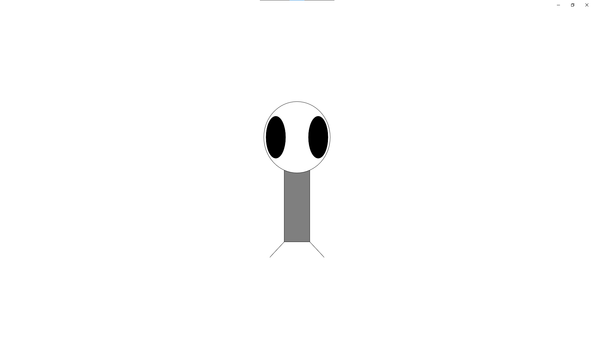
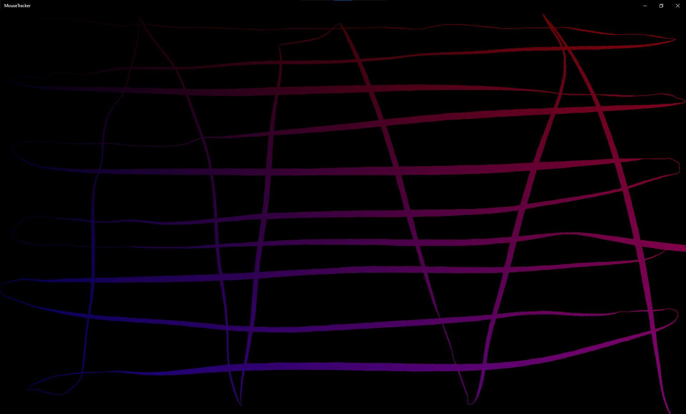
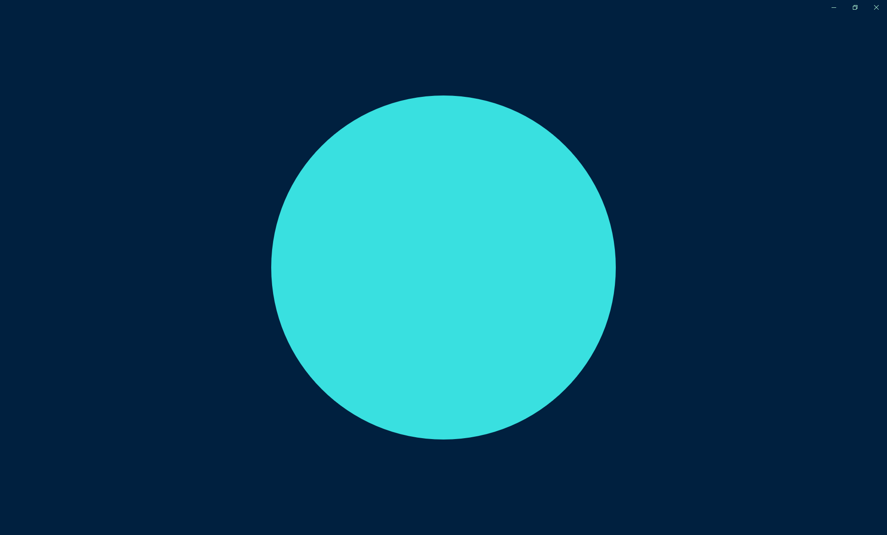
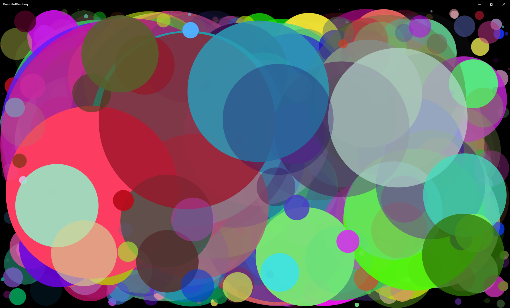

# The Coding Train Exercises
This is a collection of exercises proposed on The Coding Train Youtube channel (https://www.youtube.com/user/shiffman) but with a catch: they're implemented in C++ as UWP applications.
# How To Build
You need at least Windows 10 version 2004 and Visual Studio 2022 Preview 3. Earlier versions of Windows and Visual Studio might work but they haven't been tested.
To build the exercises:
- open up *The Coding Train Exercises.sln* solution;
- follow any prompts that might appear to install required dependencies and to enable Developer Mode;
- right click on any project or on the solution itself and select *Build* or *Build Solution*.
# The Exercises
Each exercise is a self-contained project as it doesn't depend on other projects. It can be built and run independently.
## Zoog
This exercise draws an approximation of the alien called Zoog introduced at the end of https://www.youtube.com/watch?v=n2oHuKG_BQc using the Windows.UI.Composition API.

## MouseTracker
This exercise draws a line between the current and previous mouse position using Direct2D. The line's thickness changes according to the speed of the mouse. The line's color gets more red as the mouse moves to the right and more blue as the mouse moves downwards. The exercise was proposed at the end of https://www.youtube.com/watch?v=ibW4oA7-n8I.

## CircleMorphing
This exercise animates the color and size of a circle using key frame animations provided by Windows.UI.Composition. The proposal to animate something was stated in https://www.youtube.com/watch?v=rZ36BzXFT6Q.

## PointillistPainting
This exercise draws circles using Direct2D in a random position, having a randomly sized radius and a randomly generated color. The idea to create a pointillist painting based on output given by a random number generator was expressed towards the end of https://www.youtube.com/watch?v=50Rzvxvi8D0.

